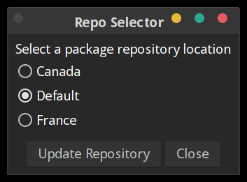

# Package Repository Selector (PRS) for GhostBSD

A tool for GhostBSD that lets you view and switch between local package repositories via a GTK-based interface.

## Overview

This application allows users to:
- View available repository configurations.
- Select a repository from the list.
- Update the system's package repository configuration file (`/usr/local/etc/pkg/repos/GhostBSD.conf`).

The application is compiled into a single binary for ease of distribution and installation.

## Installation

### Requirements

- **GhostBSD**
- **Python 3.11+** 
- `GTK3 & py311-pygobject`

### Install Steps

**Clone or Download the Repository:**
   ```sh
   git clone https://github.com/vimanuelt/Package-Repository-Selector
   ```
   ```sh
   cd Package-Repository-Selector
   ```

   Build the Application: 
   ```sh
   make
   ```

   Install the Binary: 
   ```sh
   sudo make install
   ```
   This will install the prs binary to /usr/local/bin.


### Uninstall
To remove the application: 
```sh
sudo make uninstall
```

## Usage
After installation, you can run the application from the command line: 
```sh 
prs
```

Select your desired repository from the list provided.
Click "Update Repository" to apply the change. You might be prompted for your administrative password due to the need for elevated privileges.

## Screenshot



## Notes

- This application uses pkexec for privilege escalation, which means you'll see a system authentication dialog when updating the repository configuration.
- If you encounter the message Gtk-Message: Failed to load module "xapp-gtk3-module", it's generally harmless unless you're using features that require this module. You can ignore it or install the xapp package.


## Development

- Source Code: The application is structured with the following files:
  - main.py: Entry point of the application.
  - ui.py: Handles the GTK UI.
  - repository.py: Manages repository listing and path operations.
  - system.py: Contains system-level operations like updating repositories.
  - Makefile: For building and installation.
- Dependencies: 
  - PyGObject for the GTK interface.
- Building: Use the Makefile to build the application into a single binary using PyInstaller.


## Troubleshooting

- Permissions: Ensure you have sudo rights to modify system files.
- GTK Issues: Check if all GTK dependencies are correctly installed. You might need to adjust your environment variables or install additional GTK modules.


## License

BSD 3-Clause License

Copyright (c) 2024, Vic Thacker 

All rights reserved.

Redistribution and use in source and binary forms, with or without
modification, are permitted provided that the following conditions are met:

1. Redistributions of source code must retain the above copyright notice, this
   list of conditions and the following disclaimer.

2. Redistributions in binary form must reproduce the above copyright notice,
   this list of conditions and the following disclaimer in the documentation
   and/or other materials provided with the distribution.

3. Neither the name of the copyright holder nor the names of its
   contributors may be used to endorse or promote products derived from
   this software without specific prior written permission.

THIS SOFTWARE IS PROVIDED BY THE COPYRIGHT HOLDERS AND CONTRIBUTORS "AS IS"
AND ANY EXPRESS OR IMPLIED WARRANTIES, INCLUDING, BUT NOT LIMITED TO, THE
IMPLIED WARRANTIES OF MERCHANTABILITY AND FITNESS FOR A PARTICULAR PURPOSE ARE
DISCLAIMED. IN NO EVENT SHALL THE COPYRIGHT HOLDER OR CONTRIBUTORS BE LIABLE
FOR ANY DIRECT, INDIRECT, INCIDENTAL, SPECIAL, EXEMPLARY, OR CONSEQUENTIAL
DAMAGES (INCLUDING, BUT NOT LIMITED TO, PROCUREMENT OF SUBSTITUTE GOODS OR
SERVICES; LOSS OF USE, DATA, OR PROFITS; OR BUSINESS INTERRUPTION) HOWEVER
CAUSED AND ON ANY THEORY OF LIABILITY, WHETHER IN CONTRACT, STRICT LIABILITY,
OR TORT (INCLUDING NEGLIGENCE OR OTHERWISE) ARISING IN ANY WAY OUT OF THE USE
OF THIS SOFTWARE, EVEN IF ADVISED OF THE POSSIBILITY OF SUCH DAMAGE.


## Contributions
Contributions are welcome! Please fork the repository, make your changes, and submit a pull request.

For more information or to report issues, please visit the GitHub repository (https://github.com/vimanuelt/Package-Repository-Selector/issues).

